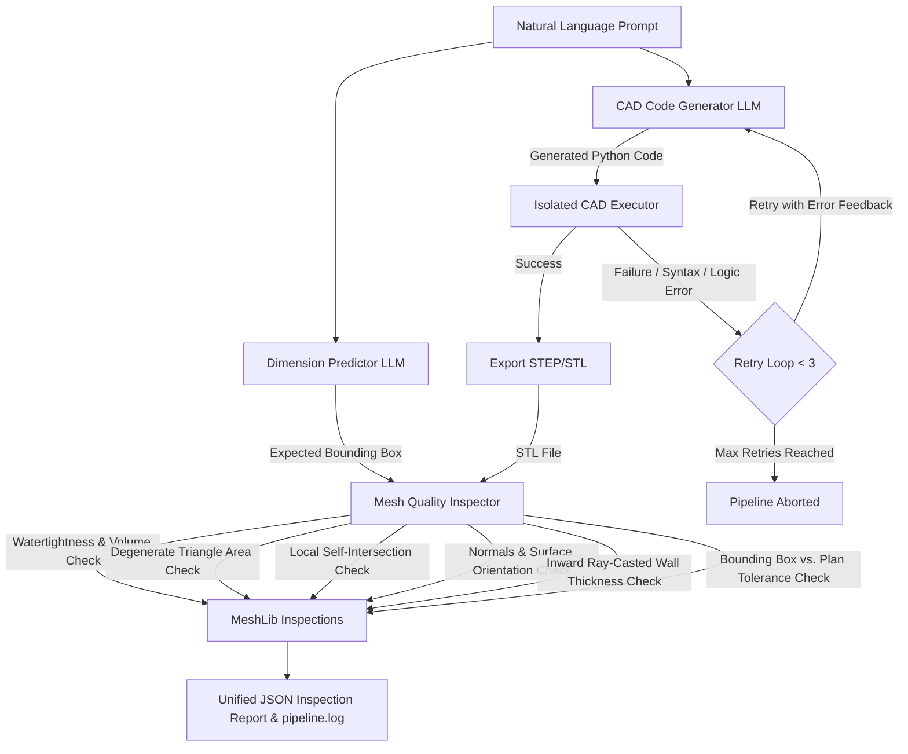

# Advanced Agentic CAD Generation & Quality Assurance Pipeline

An end-to-end, LLM-powered agentic CAD (Computer-Aided Design) pipeline. This system leverages the **Google GenAI SDK** (using Gemini 2.5 Pro) to synthesize parametric 3D models via **CadQuery**, executes the generated code in a isolated environment, exports production-ready models (STEP/STL), and runs a comprehensive multi-stage Quality Assurance (QA) suite using **MeshLib** to inspect and validate physical/geometric properties.

---

## Architecture Overview

The system operates as an autonomous agentic loop. When given a natural language design prompt, it extracts physical target constraints, writes CadQuery script code, executes it, catches and repairs errors iteratively, and runs deep mesh validation.



---

## Directory Structure

```directory
v1_capstone_ds/
├── Dockerfile              # Docker environment configuration with Conda and Pip
├── README.md               # System documentation (This file)
├── capability.md           # System capabilities & module directory reference
├── pipeline.py             # Orchestrates the generation, execution, and QA loop
├── scratch_test.py         # Utility test script for MeshLib binding verification
├── .env                    # Environment variables (API keys, etc.) [Ignored]
├── .gitignore              # Git ignore rules for outputs and virtual files
├── src/                    # Source code directory
│   ├── __init__.py
│   ├── cad_executor.py     # Isolated execution of CadQuery python scripts
│   ├── llm.py              # LLM client logic (Code generation & Dimension extraction)
│   ├── logger.py           # Unified agentic logger configuration
│   └── mesh_inspector.py   # Multi-stage MeshLib geometry & topology checking engine
├── agents/                 # Google ADK agent configurations
│   └── meshlib_agent/
│       ├── __init__.py     # Package API exposure (root_agent, run_inspection)
│       ├── agent.py        # Core ADK agent configuration & tools
│       ├── sandbox_executor.py # Isolated mesh check subprocess sandbox
│       └── observe.py      # Standalone logging/live debugging observation utility
└── outputs/                # Timestamped run directories (logs, generated code, models, reports) [Ignored]
```

---

## Module Breakdown

### 1. Master Pipeline Orchestrator (`pipeline.py`)
The central controller of the system.
*   **Job Directory Setup**: Creates a timestamped folder `outputs/run_YYYYMMDD_HHMMSS/` for every execution to store all transient inputs, logs, outputs, and validation reports.
*   **Logging Initialization**: Bootstraps the runner logger directing outputs to the terminal and `pipeline.log`.
*   **Target Extraction**: Extracts the expected 3D bounds and tolerance dynamically prior to drafting code.
*   **Self-Healing Code Loop**: Invokes the LLM to write code. If execution fails, it captures stdout/stderr and injects it back to the LLM as error feedback, running up to 3 repair cycles.
*   **Artifact Generation**: Automatically exports the solid to both boundary representation (`.step`) and tessellated mesh (`.stl`) formats.
*   **QA Run**: Triggers the validation suite, saving the results in `inspection_report.json`.
*   *Default Stress-Test Case*: Configured with a highly challenging aerodynamic centrifugal compressor impeller (requiring helical sweeps along conical profiles, variable blade thickness tapers, and complex boolean operations).

### 2. LLM Engine (`src/llm.py`)
Manages all interactions with the Gemini API using the new official `google-genai` SDK.
*   `generate_cad_code(prompt, model_name)`: Sends the design query alongside a detailed engineering system prompt instructing Gemini to write standard CadQuery code, return *only* raw python, write to a predefined `result_solid` variable, and avoid hallucinated/deprecated string selectors (e.g. `LargestAreaSelector`).
*   `extract_expected_dimensions(prompt, model_name)`: Prompts the LLM to act as a geometry parser, outputting a pure JSON object estimating target `x_mm`, `y_mm`, `z_mm`, and a dynamic `tolerance_mm` (dependent on prompt geometric complexity). Fallbacks are implemented to ensure pipeline robustness.

### 3. Isolated CAD Executor (`src/cad_executor.py`)
Handles runtime evaluation of generated geometry scripts.
*   `execute_cad_code(code)`: Instantiates a localized execution context. Runs python's dynamic `exec()` passing the `cadquery` module explicitly as `cq`. Ensures security isolation and parses the resulting workspace namespace to retrieve the `result_solid` object.
*   `export_solid(solid, filename)`: Handles exporter routing for CadQuery, converting objects into industry-standard physical files (`.step` or `.stl`).

### 4. Mesh Quality & Inspection Engine (`src/mesh_inspector.py`)
An advanced 3D inspection module utilizing **MeshLib (`meshlib.mrmeshpy`)** to ensure model validity, structural integrity, and manufacturing compliance.
*   **Watertightness Check**: Confirms the mesh is topologically closed (`mesh.topology.isClosed()`) without gaps/holes, and calculates total volume in $mm^3$.
*   **Degenerate Face Detection (`count_degenerate_faces`)**: Loops over all valid mesh faces, computes individual triangle surface areas using edge cross-products, and flags triangles with areas below `1e-6` $mm^2$, which lead to downstream CAM/slicing errors.
*   **Self-Intersections Detection (`check_self_intersections`)**: Calls MeshLib's native `localFindSelfIntersections` to flag intersecting/overlapping triangles within the single solid.
*   **Normals Consistency (`check_normals_consistency`)**: Uses `findDisorientedFaces` to detect flipped/non-manifold face normals, which cause rendering artifacts or printing errors.
*   **Wall Thickness Analysis (`check_wall_thickness`)**: For up to 500 sampled triangles, it projects an inward ray from the triangle center along the negative normal using `rayMeshIntersect`. If the intersection distance is less than the threshold (default: `2.0` mm), the face is recorded as a critical thin wall region.
*   **Dimensional Compliance (`check_dimensions_vs_plan`)**: Evaluates the model's actual bounding box dimensions (`mesh.computeBoundingBox()`) against the LLM's predicted target sizes, validating that each axis error lies within the calculated tolerance.
*   **JSON Report Compilation**: Aggregates all metrics and boolean outcomes into a finalized `inspection_report.json` alongside a final `overall_valid` flag.

### 5. Unified Logger (`src/logger.py`)
Implements an agentic log system.
*   Standardizes log lines with: `[%(asctime)s] [%(levelname)s] [%(module)s:%(funcName)s] - %(message)s`.
*   Directs human-readable info logs (`INFO`) to the console.
*   Writes deep execution trace logs (`DEBUG`), including raw LLM interactions and math calculations, to `pipeline.log`.

---

## Installation & Setup

### Environment Variables
Create a `.env` file in the root directory and add your Google Gemini API key:
```env
GEMINI_API_KEY=your_actual_gemini_api_key_here
```

### Option A: Local Installation (Condo/Mamba)
Because CadQuery and MeshLib depend on complex compiled C++ binaries, it is highly recommended to manage the environment using Conda:

1.  **Create and activate the environment**:
    ```bash
    conda create -n agentic-cad python=3.10 -y
    conda activate agentic-cad
    ```
2.  **Install CadQuery** (using official channels):
    ```bash
    conda install -y -c cadquery -c conda-forge cadquery
    ```
3.  **Install MeshLib & Python dependencies**:
    ```bash
    pip install meshlib google-genai pydantic python-dotenv
    ```

### Option B: Docker Setup (Recommended for Isolation)
To run the entire pipeline inside a clean, reproducible containerized environment. The Dockerfile compiles CadQuery and installs dependencies (`google-adk`, `fastapi`, `uvicorn`, `meshlib` etc.) required to execute the pipeline and serve the agent UI.

1.  **Build the Docker image**:
    ```bash
    docker build -t agentic-cad-pipeline .
    ```
2.  **Run the container** (passing your API key as an environment variable):
    ```bash
    docker run --env-file .env -v "$(pwd)/outputs:/app/outputs" agentic-cad-pipeline
    ```
    *Note: The `-v` flag mounts the local `outputs/` folder to access step files, STL files, logs, and JSON reports generated inside the container.*

---

## Verification and Execution

### Running the Pipeline
To launch the centrifugal impeller test case:
```bash
python pipeline.py
```

### Google ADK Agent Console & Server Commands
You can run the ADK Agent Web Console or the API Server locally using the workspace virtual environment. To share and view agent logs generated from `pipeline.py` or `observe.py` executions, point the commands to the shared SQLite database and use distinct ports to avoid port binding conflicts:

*   **FastAPI Web UI Console (With Step-by-Step History Log):**
    ```bash
    ./agents/.agnts/bin/python -m google.adk.cli web --session_service_uri sqlite:///outputs/adk_sessions.db --port 8080 agents
    ```
    *Open `http://127.0.0.1:8080` in your browser. Click the **Sessions** tab in the sidebar and select a session to view the exact step-by-step reasoning timeline, generated code tools, execution logs, and final verdicts.*

*   **FastAPI REST API Server (Programmatic Agent Access):**
    ```bash
    ./agents/.agnts/bin/python -m google.adk.cli api_server --session_service_uri sqlite:///outputs/adk_sessions.db --port 8000 agents
    ```
    *Serves the agent over standard REST endpoints at `http://127.0.0.1:8000` while logging run events to the same SQLite database.*

### Live Console Observability & Debugging
To inspect the internal reasoning, code generation, and sandboxed execution output of the MeshLib Agent in real-time with colorized terminal logging:

1.  **Run the live inspector shell utility**:
    ```bash
    python agents/meshlib_agent/observe.py
    ```
2.  Follow the prompts or supply arguments to inspect specific STL files and view full agent thoughts, python code generation, raw sandboxed compiler tracebacks, and classification verdicts.

### Output Artifacts
Inside `outputs/run_[timestamp]/`, you will find:
*   `generated_code_attempt_[N].py`: The code drafted by the LLM on attempt N.
*   `pipeline.log`: Complete debug log of all generation steps, CAD compilation, and inspection traces.
*   `model.step`: Boundary representation model, ready for importing into professional CAD suites (SolidWorks, Fusion360, etc.).
*   `model.stl`: Tessellated mesh, ready for 3D printing slicing.
*   `inspection_report.json`: Detailed JSON structure indicating the geometric/topological status of the mesh.

#### Example `inspection_report.json`
```json
{
    "base_stats": {
        "is_watertight": true,
        "volume_mm3": 128504.32
    },
    "degenerate_faces": 0,
    "self_intersections": {
        "has_self_intersections": false,
        "intersecting_face_count": 0
    },
    "normals_consistency": {
        "normals_consistent": true,
        "flipped_regions": 0
    },
    "wall_thickness": {
        "min_wall_thickness_mm": 5.0,
        "thin_region_count": 0,
        "passes_minimum": true,
        "thin_regions_sample": []
    },
    "dimensions_check": {
        "dimensions": {
            "x_mm": {
                "expected": 100.0,
                "measured": 100.0,
                "delta_mm": 0.0,
                "tolerance_mm": 5.0,
                "passed": true
            },
            "y_mm": {
                "expected": 100.0,
                "measured": 100.0,
                "delta_mm": 0.0,
                "tolerance_mm": 5.0,
                "passed": true
            },
            "z_mm": {
                "expected": 60.0,
                "measured": 60.0,
                "delta_mm": 0.0,
                "tolerance_mm": 5.0,
                "passed": true
            }
        },
        "all_dimensions_pass": true
    },
    "overall_valid": true
}
```
