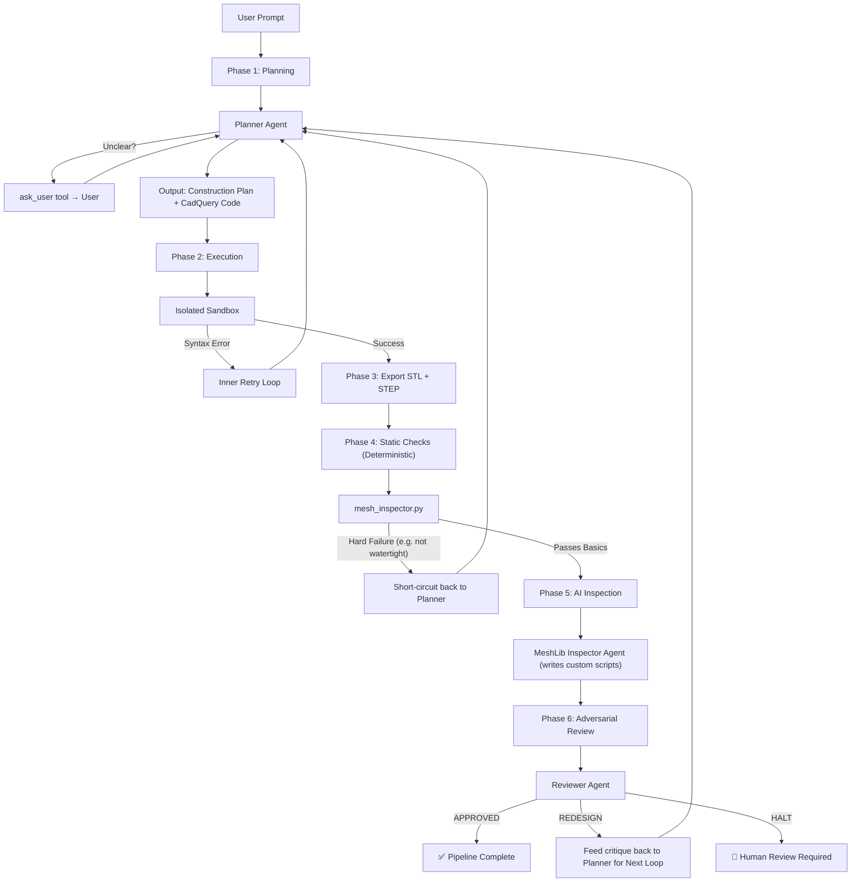

# Advanced Agentic CAD Generation & Quality Assurance Pipeline

Welcome! This repository hosts an end-to-end, adversarial multi-agent pipeline for generating and verifying Computer-Aided Design (CAD) models. 

This system uses **Google Gemini 3.1 Pro** via the **Google ADK** to write parametric 3D modeling code, and then it unleashes two adversarial AI agents to inspect, critique, and debug the resulting 3D models before delivering the final `.step` files to you.

---

## 🧠 The "Adversarial Multi-Agent" Architecture Explained

Most AI coding agents have a major flaw: **Hallucination**. If you ask an AI to write code to build a 2mm thick wall, it might write code that builds a 1mm wall, but confidently *tell you* it built a 2mm wall. If you ask another AI to review it, that AI might just look at the code, assume it works, and "rubber-stamp" it. 

We solve this using a multi-agent system built on three core principles:

### 1. Deterministic Ground Truth
Before the AI is allowed to "think" about the 3D model, we run hardcoded, mathematical C++ algorithms (`mesh_inspector.py`) on the generated mesh. This checks for objective physical realities: Is the mesh watertight? Does it have a volume? What is its actual, measurable minimum wall thickness? This provides a mathematically unshakeable "ground truth".

### 2. Information Asymmetry (Anti-Rubber-Stamping)
The pipeline features two AI agents in the review phase:
1.  **The MeshLib Inspector Agent**: This agent writes custom Python scripts to measure the 3D model. However, it is prone to hallucination (it might write a bad script and draw the wrong conclusion). It reports its findings.
2.  **The Adversarial Reviewer Agent**: This agent is the ultimate judge. **It never sees the original code.** It is only given your initial request, the deterministic ground truth (from step 1), and the MeshLib Inspector's findings. 

### 3. Adversarial Verification
Because the Reviewer Agent has the mathematical ground truth, it can instantly catch the Inspector Agent if it lies! 
If the Inspector claims *"The wall thickness is 2.0mm and passes"*, but the ground truth says *"Minimum wall thickness is 0.9mm"*, the Reviewer Agent flags the discrepancy, overrules the Inspector, and forces the system to **REDESIGN** the model.

---

## The 6-Phase Pipeline Workflow

When you run the pipeline, it executes the following phases in a loop (up to 3 times) until the Reviewer Agent approves the design:



---

## 📂 Understanding the Output Files

Every time you run the pipeline, it creates a new folder in `outputs/` named with a timestamp (e.g., `run_20260523_101816`). 

Inside this folder, **every single file is chronologically numbered and tagged with its "Loop Iteration"** (e.g., `outer1`, `outer2`). This allows you to track exactly what the AI did on the first attempt, why it failed, and what it did to fix it on the second attempt!

**The Master Execution Log**
*   `00_pipeline_execution.log`: The unified text log showing every step, error, and decision across the entire pipeline. 
*   `01_design_brief.json`: The mathematical dimensions the AI extracted from your original prompt.

**The Loop Files (Repeated for Iteration 1, 2, 3...)**
*   `02_outer[X]_planner_construction_plan.txt`: The text plan the CAD Engineer AI wrote *before* it wrote any code.
*   `03_outer[X]_inner[Y]_planner_generated_cad_code.py`: The actual Python CadQuery code the AI generated.
*   `04_outer[X]_exported_model.step`: The professional CAD solid model for this attempt.
*   `04_outer[X]_exported_model.stl`: The tessellated mesh model for this attempt.
*   `05_outer[X]_static_inspection_ground_truth.json`: The deterministic mathematical measurements of the model.
*   `06a_outer[X]_ai_inspector_findings.json`: The AI Inspector's report on the model.
*   `06b_outer[X]_ai_inspector_conversation_trace.json`: The raw log of the AI Inspector's thought process.
*   `06c_outer[X]_ai_generated_meshlib_script_[Z].py`: Every custom Python script the AI Inspector wrote to measure the mesh.
*   `07_outer[X]_adversarial_reviewer_verdict.json`: The final decision by the Reviewer Agent. If this says "REDESIGN", the pipeline loops back to step 02 and tries again!

---

## 🚀 Installation & Execution

### 1. Set your API Key
Create a `.env` file in the root of the project and add your Gemini API key:
```env
GEMINI_API_KEY=your_actual_gemini_api_key_here
```

### 2. Run the Pipeline in Docker (Recommended)
Because CAD operations rely on complex C++ binaries, it is highly recommended to run this pipeline via Docker so you don't mess up your local Python environment.

**Build the Docker Image:**
```bash
docker build -t agentic-cad-pipeline .
```

**Run the Pipeline (Non-Interactive):**
```bash
docker run --env-file .env -v "$(pwd)/outputs:/app/outputs" agentic-cad-pipeline python pipeline.py
```
*(The `-v` flag mounts the `/app/outputs` folder inside the container to the `outputs/` folder on your actual computer, so the CAD files are saved directly to your hard drive).*

### 3. View the AI's Thoughts in the Web UI
This system uses the Google ADK, which comes with a beautiful Web UI that lets you see the internal reasoning, tool calls, and error traces of the AI agents in real-time.

To launch the UI locally on your machine, run:
```bash
./agents/.agnts/bin/python -m google.adk.cli web --session_service_uri sqlite:///outputs/adk_sessions.db --port 8080 agents
```
Then, open `http://127.0.0.1:8080` in your web browser. Click the **Sessions** tab on the left to review the exact step-by-step reasoning for `planner_agent`, `meshlib_agent`, and `reviewer_agent`.
