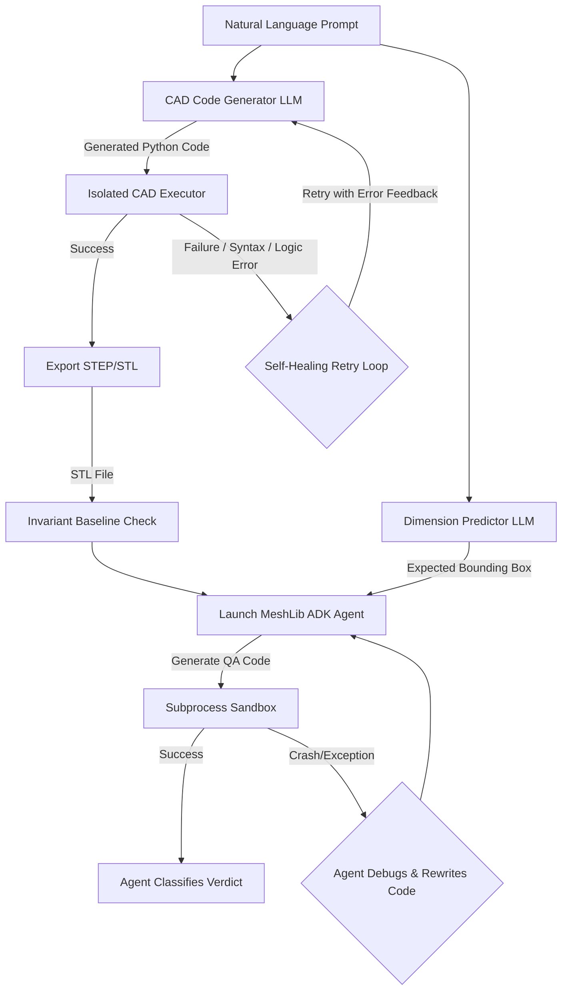

# Advanced Agentic CAD Generation & Quality Assurance Pipeline

An end-to-end, LLM-powered agentic CAD (Computer-Aided Design) pipeline. This system leverages the **Google GenAI SDK** (using Gemini 2.5 Pro) to synthesize parametric 3D models via **CadQuery**, executes the generated code in an isolated environment, exports production-ready models (STEP/STL), and runs a comprehensive Quality Assurance (QA) suite using both static invariant checks and an autonomous **MeshLib ADK Agent** to deeply inspect and validate physical/geometric properties.

---

## 🧠 Hybrid Architecture: Workflows Meets Agents

This system is built using a **hybrid architecture** that embeds true autonomous agents within a reliable, deterministic workflow. This provides the safety and predictability of traditional software engineering while leveraging the dynamic reasoning and self-correcting capabilities of LLMs.

### 1. The Macro Workflow (Deterministic)
The master pipeline (`pipeline.py`) dictates the high-level sequence:
`Prompt -> Extract Dimensions -> Generate CAD -> Export Files -> Run Invariant Checks -> Launch Autonomous Agent -> Final Verdict`.

### 2. Agentic Pattern A: Self-Healing Code Generation
During the CAD generation phase, if the LLM writes invalid CadQuery Python code that crashes during execution, the workflow catches the exception and feeds the stack trace back to the LLM. The LLM reflects on its error and dynamically rewrites the code in a self-healing loop (up to 3 attempts) until successful.

### 3. Agentic Pattern B: The MeshLib Autonomous Agent
During the QA phase, control flow is handed over to the **MeshLib Inspector Agent** (built with the Google ADK). This is a true autonomous agent:
*   **Persona & Goal:** It is instructed to act as a QA Engineer, verifying complex dimensional constraints against a generated mesh.
*   **Tool Use:** It independently writes custom Python inspection code using MeshLib APIs and executes it in an isolated sandbox.
*   **ReAct Loop:** If its inspection script fails or throws a logic error, the agent reads the subprocess `stderr`, debugs its own code, and re-executes.
*   **Decision Making:** It autonomously analyzes the measurement outputs and classifies failures logically (e.g., distinguishing between Class A topology errors vs. Class C design intent deviations).

---

## Architecture Overview



---

## Directory Structure

```directory
v1_capstone_ds/
├── Dockerfile              # Docker environment configuration with Conda and Pip
├── README.md               # System documentation (This file)
├── capability.md           # System capabilities & module directory reference
├── pipeline.py             # Orchestrates the generation, execution, and QA loop
├── scratch_test.py         # Utility test script for MeshLib binding verification
├── .env                    # Environment variables (API keys, etc.) [Ignored]
├── .gitignore              # Git ignore rules for outputs and virtual files
├── src/                    # Source code directory
│   ├── __init__.py
│   ├── cad_executor.py     # Isolated execution of CadQuery python scripts
│   ├── llm.py              # LLM client logic (Code generation & Dimension extraction)
│   ├── logger.py           # Unified agentic logger configuration
│   └── mesh_inspector.py   # Multi-stage MeshLib geometry & topology checking engine
├── agents/                 # Google ADK agent configurations
│   └── meshlib_agent/
│       ├── __init__.py     # Package API exposure (root_agent, run_inspection)
│       ├── agent.py        # Core ADK agent configuration & tools
│       ├── sandbox_executor.py # Isolated mesh check subprocess sandbox
│       └── observe.py      # Standalone logging/live debugging observation utility
└── outputs/                # Timestamped run directories (logs, generated code, models, reports) [Ignored]
```

---

## Module Breakdown

### 1. Master Pipeline Orchestrator (`pipeline.py`)
The deterministic controller of the system.
*   **Job Directory Setup**: Creates a timestamped folder `outputs/run_YYYYMMDD_HHMMSS/` for every execution.
*   **Target Extraction**: Extracts expected 3D bounds dynamically.
*   **Self-Healing Code Loop**: Invokes the LLM to write CadQuery code. Iteratively repairs failing code up to 3 times based on execution stack traces.
*   **Artifact Generation**: Automatically exports the solid to both boundary representation (`.step`) and tessellated mesh (`.stl`) formats.
*   **QA Run**: Triggers the static and autonomous validation suites.

### 2. LLM Engine (`src/llm.py`)
Manages all interactions with the Gemini API using the new `google-genai` SDK.
*   Generates standard CadQuery scripts based on engineering prompts.
*   Extracts geometric dimension expectations dynamically into JSON form.

### 3. Isolated CAD Executor (`src/cad_executor.py`)
Handles runtime evaluation of generated geometry scripts using Python's dynamic `exec()`. Evaluates the CadQuery code in a local namespace to ensure security and captures the final `result_solid` object.

### 4. MeshLib Autonomous Inspector Agent (`agents/meshlib_agent/`)
An advanced autonomous agent built using the **Google ADK**.
*   **`agent.py`**: The brain. Reads the physical blueprint, writes MeshLib python code to measure and verify properties, calls tools to execute that code, automatically repairs the code if it fails, and provides a final structural verdict.
*   **`sandbox_executor.py`**: A vital security layer. Since MeshLib utilizes a C++ backend (OCCT) that will Segfault on bad memory allocations, the agent's code runs in a completely isolated subprocess. This protects the parent pipeline from fatal crashes.

### 5. Advanced Static Inspection (`src/mesh_inspector.py`)
Provides fast, invariant baseline checks using MeshLib before the agent assumes control.
*   **Watertightness & Volume**: Confirms the mesh is topologically closed.
*   **Self-Intersections & Degenerate Faces**: Flags structural mesh errors that cause rendering or printing issues.
*   **Wall Thickness**: Uses raycasting to verify minimum structural limits.

### 6. Unified Logger (`src/logger.py`)
Implements an agentic log system routing INFO logs to the terminal and detailed DEBUG traces (including raw LLM outputs) to `pipeline.log`.

---

## Installation & Setup

### Environment Variables
Create a `.env` file in the root directory and add your Google Gemini API key:
```env
GEMINI_API_KEY=your_actual_gemini_api_key_here
```

### Option A: Local Installation (Condo/Mamba)
Because CadQuery and MeshLib depend on complex compiled C++ binaries, it is highly recommended to manage the environment using Conda:

1.  **Create and activate the environment**:
    ```bash
    conda create -n agentic-cad python=3.10 -y
    conda activate agentic-cad
    ```
2.  **Install CadQuery** (using official channels):
    ```bash
    conda install -y -c cadquery -c conda-forge cadquery
    ```
3.  **Install MeshLib & Python dependencies**:
    ```bash
    pip install meshlib google-genai pydantic python-dotenv
    ```

### Option B: Docker Setup (Recommended for Isolation)
To run the entire pipeline inside a clean, reproducible containerized environment. The Dockerfile compiles CadQuery and installs dependencies (`google-adk`, `fastapi`, `uvicorn`, `meshlib` etc.) required to execute the pipeline and serve the agent UI.

1.  **Build the Docker image**:
    ```bash
    docker build -t agentic-cad-pipeline .
    ```
2.  **Run the container** (passing your API key as an environment variable):
    ```bash
    docker run --env-file .env -v "$(pwd)/outputs:/app/outputs" agentic-cad-pipeline
    ```
    *Note: The `-v` flag mounts the local `outputs/` folder to access step files, STL files, logs, and JSON reports generated inside the container.*

---

## Verification and Execution

### Running the Pipeline
To launch the centrifugal impeller test case:
```bash
python pipeline.py
```

### Google ADK Agent Console & Server Commands
You can run the ADK Agent Web Console or the API Server locally using the workspace virtual environment. To share and view agent logs generated from `pipeline.py` or `observe.py` executions, point the commands to the shared SQLite database and use distinct ports to avoid port binding conflicts:

*   **FastAPI Web UI Console (With Step-by-Step History Log):**
    ```bash
    ./agents/.agnts/bin/python -m google.adk.cli web --session_service_uri sqlite:///outputs/adk_sessions.db --port 8080 agents
    ```
    *Open `http://127.0.0.1:8080` in your browser. Click the **Sessions** tab in the sidebar and select a session to view the exact step-by-step reasoning timeline, generated code tools, execution logs, and final verdicts.*

*   **FastAPI REST API Server (Programmatic Agent Access):**
    ```bash
    ./agents/.agnts/bin/python -m google.adk.cli api_server --session_service_uri sqlite:///outputs/adk_sessions.db --port 8000 agents
    ```
    *Serves the agent over standard REST endpoints at `http://127.0.0.1:8000` while logging run events to the same SQLite database.*

### Live Console Observability & Debugging
To inspect the internal reasoning, code generation, and sandboxed execution output of the MeshLib Agent in real-time with colorized terminal logging:

1.  **Run the live inspector shell utility**:
    ```bash
    python agents/meshlib_agent/observe.py
    ```
2.  Follow the prompts or supply arguments to inspect specific STL files and view full agent thoughts, python code generation, raw sandboxed compiler tracebacks, and classification verdicts.

### Output Artifacts
Inside `outputs/run_[timestamp]/`, you will find:
*   `generated_code_attempt_[N].py`: The code drafted by the LLM on attempt N.
*   `pipeline.log`: Complete debug log of all generation steps, CAD compilation, and inspection traces.
*   `model.step`: Boundary representation model, ready for importing into professional CAD suites.
*   `model.stl`: Tessellated mesh, ready for 3D printing slicing.
*   `ai_inspection_verdict.json`: The final classification verdict dynamically generated by the ADK agent.
*   `inspection_report.json`: Detailed static JSON structure indicating the geometric/topological baseline status of the mesh.
